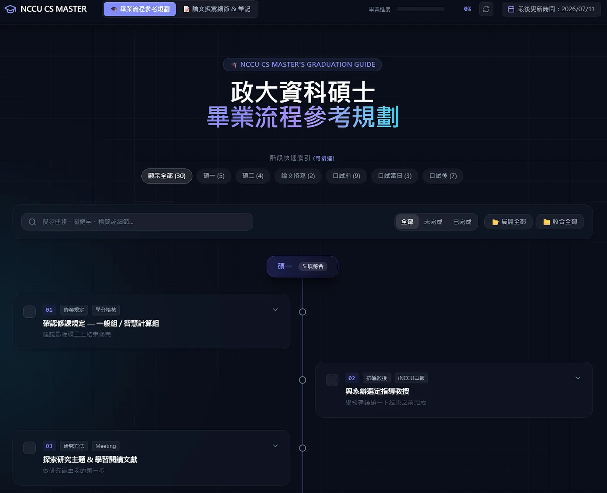

# 政大資科碩士畢業流程參考規劃

各位政大資科的學弟妹、同學們好，我是 114 學年度的畢業生。

碩士班這三年的時間說長不長、說短不短，但對於大多數人來說，最讓人焦慮的往往不是研究本身，而是「我現在的進度到底正不正常？」、「口試前到底要準備什麼？」以及「畢業手續有哪些細節要跑？」。

回想自己在這三年間，也曾因為論文撰寫、口試申請、畢業離校等種種繁瑣的流程與時間點感到迷惘。為了讓未來即將或正在撰寫論文、準備口試的你，能有一個更清晰、更有系統的進度參考，我將自己這三年累積的經驗與政大資科的規範，整理並製作成了一個網頁。

🔗 **[點此前往網站：政大資科碩士畢業流程參考規劃](https://thesis-writing-assistant-17673238242.asia-south1.run.app)** /n
🔗 [Medium 好讀版](https://medium.com/@jeremy900425/%E6%94%BF%E5%A4%A7%E8%B3%87%E7%A7%91%E7%A2%A9%E5%A3%AB%E7%95%A2%E6%A5%AD%E6%B5%81%E7%A8%8B%E5%8F%83%E8%80%83%E8%A6%8F%E5%8A%83-441a5af190ff)

---

## 這個工具有什麼？

這個工具提供給你客觀、清晰的「任務清單」，幫助你把龐大的畢業壓力拆解成各個階段的具體步驟：

*   **畢業流程參考規劃**：從碩一、碩二、論文撰寫、口試前一個月，到口試當天與最後的離校手續，依時間軸整理出每個階段「該做什麼事」，並附帶可勾選的互動清單。
*   **畢業相關規範與要點**：整理了學校與系所的規範，讓你不必在學校官網中找來找去。
*   **完全獨立的個人進度條**：網站採用瀏覽器本地儲存（Local Storage）。你勾選的進度只會保存在你自己的電腦中，不會上傳到任何伺服器，既保障個人隱私，也能讓你擁有專屬的進度追蹤。

*註：雖然主要是以政大資科為主，但其他學校或科系的碩士生亦可參考其中的架構與章節。*

---

## 給學弟妹的一封信

撰寫論文與畢業，是一場與自己的馬拉松。

每個人因為研究領域、指導教授、以及生涯規劃的不同，畢業的步調本來就不盡相同，這也是為什麼我特別將名稱改為「參考規劃」的原因，實際論文撰寫還是要以實驗室與指導教授的規定為準！

這份規劃工具並不是要給各位施加時間壓力，而是希望在當你感到迷茫、不知道下一步該怎麼走時，能有一個可以對照的「地圖」，讓心裡多一份安定感。

## 回饋與貢獻

系上規定隨時會改變（例如近年不需要繳實體論文到系辦），如果你在使用網頁的過程中，發現內容有任何錯誤，或者需要補充或更新的資訊，都非常歡迎隨時寄信與我通知！

*   **聯絡信箱**：112753138@g.nccu.edu.tw 
*   或點擊網頁最下方資訊欄進行回饋。

祝大家研究順利，口試順利，都能在屬於自己的節奏中，順利畢業！

---

## 關鍵字
政大資科, 碩士畢業, 撰寫論文, 碩班規畫, 口試準備
